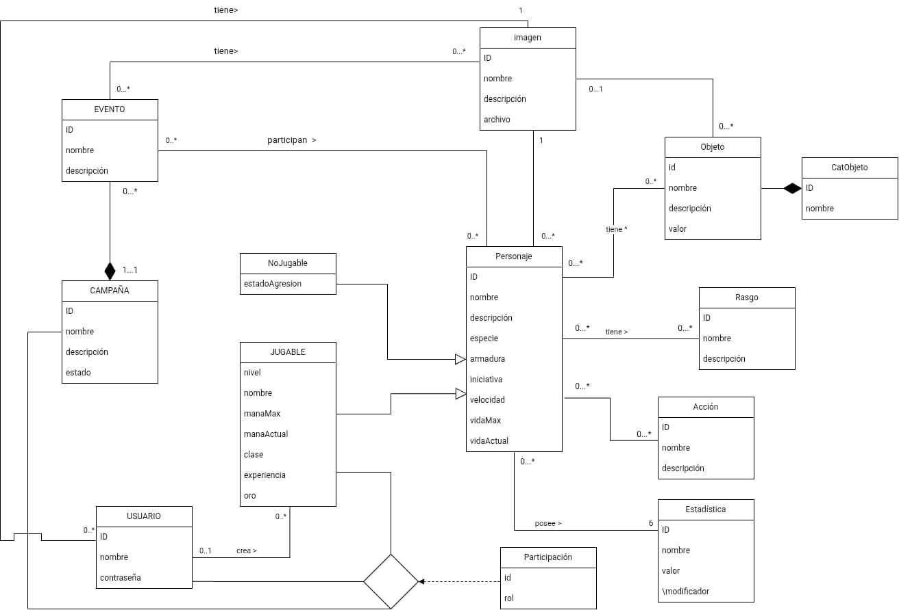

# Propuesta TP DSW

## Grupo
### Integrantes
* 52285 - Gregoret, Agustín
* 53081 - Huanambal, Ivo
* 53742 - Bolzico, Nicolás
* 53952 - Cabrera, Martín Leonel

### Repositorios
* [frontend app](http://hyperlinkToGihubOrGitlab)
* [backend app](http://hyperlinkToGihubOrGitlab)

*Nota*: si utiliza un monorepo indicar un solo link con fullstack app.

---

## Tema

### Descripción
Aplicación web para la gestión de campañas de juegos de rol de mesa (TTRPG), permitiendo crear campañas, administrar personajes y organizar eventos.  
Facilita la interacción entre jugadores y directores de juego, así como el seguimiento del estado y progreso de los personajes.

---

### Modelo

*Nota*: incluir un link con la imagen de un modelo, puede ser modelo de dominio, diagrama de clases, DER. Si lo prefieren pueden utilizar diagramas con [Mermaid](https://mermaid.js.org) en lugar de imágenes.

---

## Alcance Funcional 

### Alcance Mínimo

Regularidad:

|Req|Detalle|
|:-|:-|
|CRUD simple|1. CRUD Usuario 2. CRUD Campaña 3. CRUD Rasgo 4. CRUD CatObjeto|
|CRUD dependiente|1. CRUD Personaje {depende de} CRUD Usuario 2. CRUD Personaje {depende de} CRUD Usuario|
|Listado + detalle|1. Listado de campañas filtrado por estado, muestra nombre, master e imagen => detalle permite unirse y entrar a la sesión 2. Listado de NPC filtrado por estadoAgresión, muestra nombre y descripción => detalle con todos los atributos|
|CUU/Epic|1. CUU crear un evento con su descripción e imagenes y asignarle personajes 2. Comenzar campaña y activar un evento|

---

### Adicionales para Aprobación

|Req|Detalle|
|:-|:-|
|CRUD |1. CRUD Usuario 2. CRUD Campaña 3. CRUD Participación 4. CRUD Personaje 5. CRUD Jugable 6. CRUD NoJugable 7. CRUD Objeto 8. CRUD CatObjeto 9. CRUD Rasgo 10. CRUD Acción 11. CRUD Estadística 12. CRUD Imagen|
|CUU/Epic|1. Crear un personaje con atributos, habilidades, estadísticas y objetos 2. Sistema de chat entre jugadores en partida. 3. Activar evento y consultar estado de personajes participantes 4. Modificar atributos y gestionar objetos durante la campaña|

---

## Alcance Adicional Voluntario

|Req|Detalle|
|:-|:-|
|Listados |1. Listado de objetos de un personaje filtrado por categoría, muestra nombre y valor => detalle con descripción e imagen|
|CUU/Epic|1. Invitar usuario a campaña privada y confirmar ingreso 2. Asignar personaje a campaña|
|Otros|1. Envío de invitación o notificación por email 2. Sistema de dados que puede utilizarse en campaña y escribe resultado por el chat|
